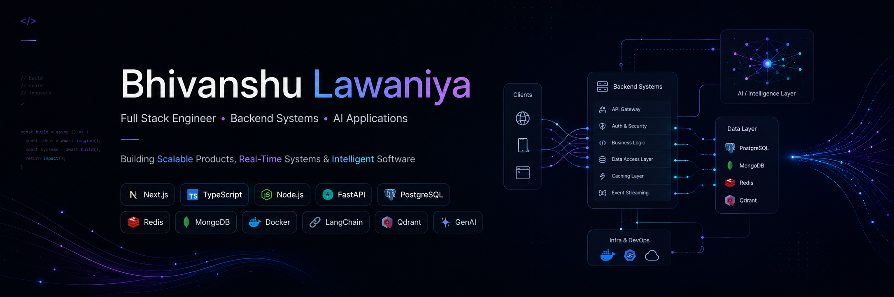

<div align="center">



# 👋 Hi, I'm Bhivanshu Lawaniya

### Full Stack Engineer • Backend Systems • AI Applications

<p align="center">
Building Scalable Products • Real-Time Systems • Intelligent Software
</p>


<br/>

<a href="https://www.linkedin.com/in/bhivanshu-lawaniya-b668a7290/">

</a>

<a href="https://github.com/Bhivanshu45">

</a>

<a href="mailto:bhivanshulawaniya@gmail.com">

</a>

<a href="https://leetcode.com/u/Bhivanshu_Lawaniya/">

</a>

<a href="https://www.codechef.com/users/crusader45">

</a>

<br/><br/>


</div>

---

# 🚀 About Me

```typescript
const bhivanshu = {
    role: "Full Stack Engineer",

    education: "B.Tech @ IIIT Bhagalpur (2027)",

    expertise: [
        "Backend Systems",
        "Full Stack Applications",
        "Real-Time Architectures",
        "Authentication & Security",
        "AI-Powered Products"
    ],

    currentlyBuilding: [
        "NewsLens - AI News Intelligence Platform",
        "Technestia - Developer Collaboration Platform"
    ],

    currentlyLearning: [
        "Agentic AI",
        "LangGraph",
        "Advanced RAG",
        "System Design"
    ]
};
```

---

## ⚡ Tech Stack

<p align="center">

</p>

**Frontend:** React • Next.js • Tailwind CSS • Bootstrap • Shadcn UI • Framer Motion

**Backend:** Node.js • Express.js • FastAPI • Django • Socket.IO

**Databases:** MongoDB • PostgreSQL • MySQL • Redis • Qdrant

**Authentication:** NextAuth.js • OAuth • JWT • RBAC • Rate Limiting

**AI & GenAI:** LangChain • RAG • Embeddings • Semantic Search • Gemini API • LLM Integrations

**ORMs & Validation:** Prisma • Mongoose • Sequelize • SQLAlchemy • Zod

**Tools:** Docker • Git • GitHub Actions • Linux • Postman • Jira • Cloudinary • Twilio • Resend

---

## 📈 GitHub Analytics

<div align="center">


</div>

<br/>

<div align="center">


</div>

---

## 🌟 Featured Projects

| Project                    | Description                                                             |
| -------------------------- | ----------------------------------------------------------------------- |
| 🚀 **SkillNova**           | Full Stack EdTech Platform focused on modern learning experiences       |
| 👥 **Technestia**          | Developer Collaboration Platform with RBAC, OAuth and Realtime Features |
| 💬 **Mystery Message Box** | Anonymous Messaging Platform with AI-generated Reply Suggestions        |

---

## 🏆 Competitive Programming

🛡️ **Knight @ LeetCode (1884 Rating)**

💻 **600+ DSA Problems Solved**

⭐ **3★ CodeChef**

---

## 🐍 Contribution Snake

<div align="center">


</div>

---

## 🤝 Let's Connect

<div align="center">

📧 **[bhivanshulawaniya@gmail.com](mailto:bhivanshulawaniya@gmail.com)**

💼 LinkedIn

💻 GitHub

</div>

---

<div align="center">

### 🚀 Building Full-Stack Products, Real-Time Systems & AI Applications

</div>
